Make a video: manim -pql scene.py FOLDERNAME
Make a gif: ./make_gif FOLDERNAME SCENENAME
Make all gifs from a folder: ./make_gif FOLDERNAME

## CDC23: proof
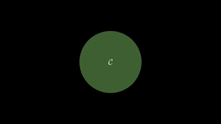

## CDC23: safety
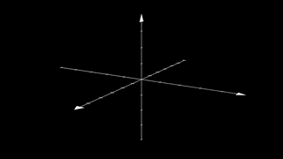

## CDC23: normal_vs_sd_safety
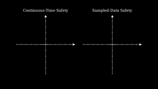

## CDC23: compounding_errors
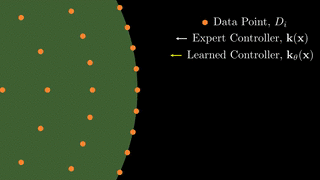

## CDC23: imitation_learning
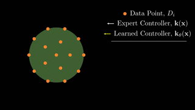

## CDC23: robustness_radius
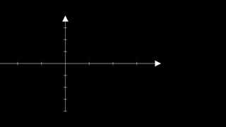

## CDC23: cbf_compliance3
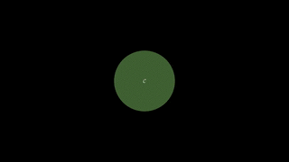

## CDC23: set_inv
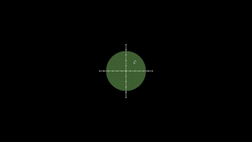

## CDC23: upper_semi_cont
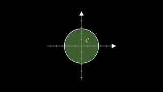

## CDC23: cbf_compliance

## CDC23: issf
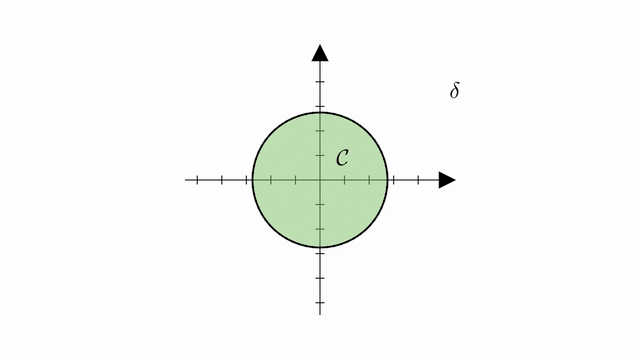

## CDC23: zoh_manim
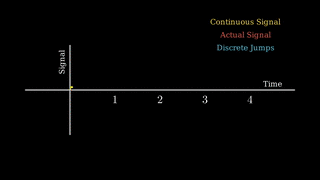
